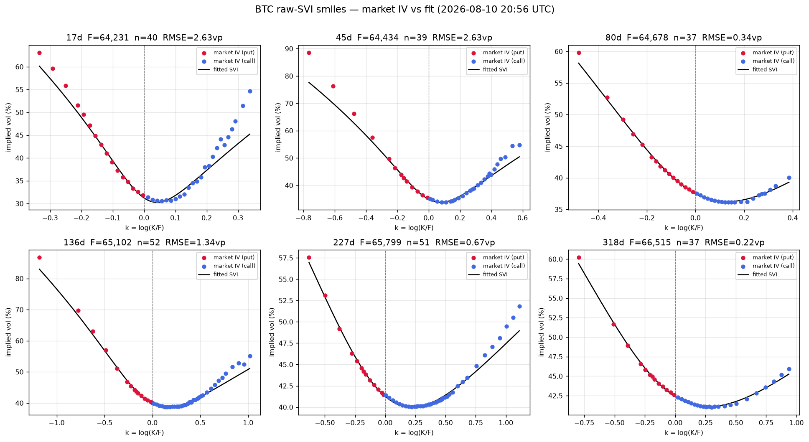
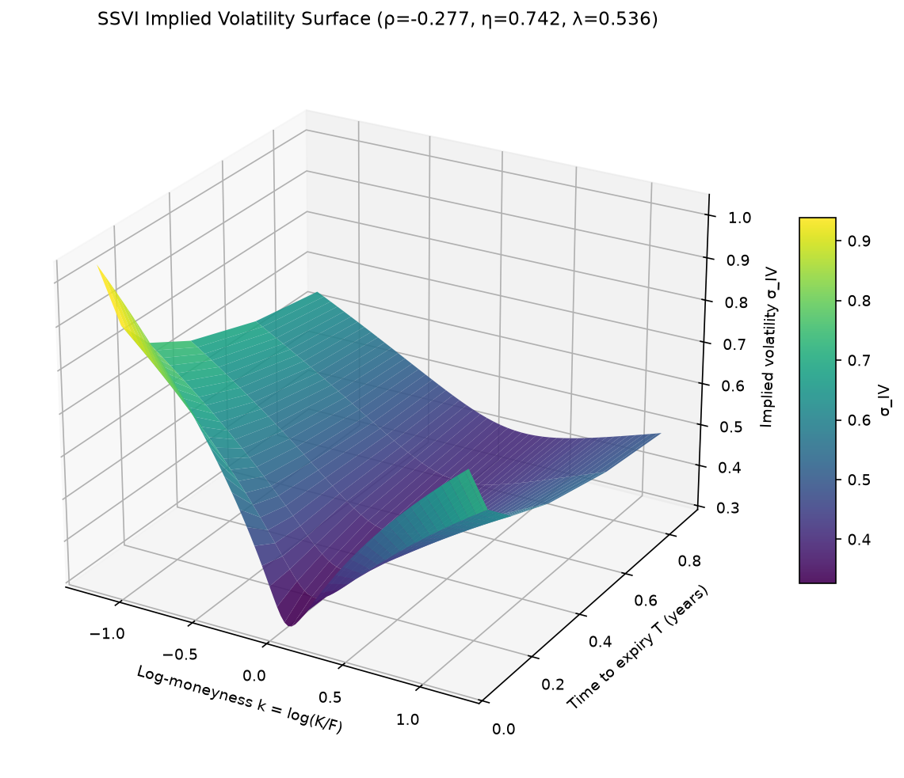
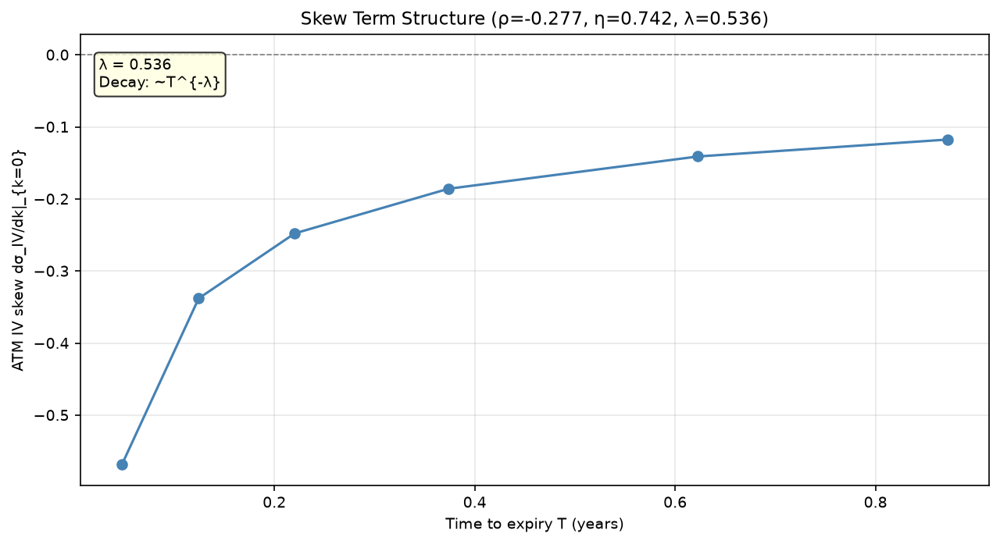
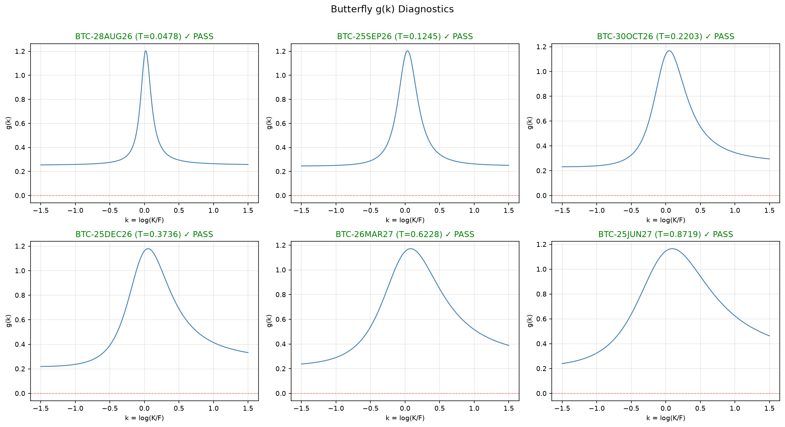

# volsurface

**Arbitrage-free implied volatility surface construction for crypto options.**

`volsurface` takes a live option chain and turns it into a clean, calibrated, no-arbitrage
volatility surface — the object traders and risk systems actually use to price and hedge.
The full pipeline is:

```
Deribit option chain  →  clean quotes  →  forwards (put-call parity)  →  implied vol
      →  raw SVI per expiry  →  no-arbitrage checks  →  global SSVI surface  →  diagnostics
```

Everything below is generated by the library itself from a **live** Deribit snapshot — no
synthetic data, no hand-tuning. Reproduce it with:

```bash
python examples/live_surface_demo.py
```

---

## What it does, shown on live BTC data

*Snapshot: 2026-08-10 20:56 UTC · BTC spot $64,094 · 794 raw quotes → 663 cleaned · 6 expiries (17d–318d).*

### 1. Fit each expiry's smile (raw SVI)

For every expiry, market implied vols (inverted from mid prices via Black-76) are fit with the
**raw SVI** parameterization using the Zeliade quasi-explicit method. Puts (red) and calls (blue)
are plotted against log-moneyness `k = log(K/F)`; the black curve is the fitted slice.



Fit quality on this snapshot: RMSE **0.22–2.6 vol points** per slice. The negative skew (puts
richer than calls) is the classic crypto/equity fear premium.

### 2. Tie the slices into one surface (SSVI)

The per-expiry fits are unified into a single **SSVI** surface (Gatheral–Jacquier), which
guarantees a consistent shape across strike *and* maturity from just three global parameters.



Global fit here: **R² = 0.9992**, ρ = −0.28, η = 0.74, λ = 0.54 — a steep left wing that flattens
with maturity, exactly as expected.

### 3. Term structure of skew

How the at-the-money skew (∂σ/∂k) evolves with time to expiry — short-dated options carry the
sharpest skew, decaying into the longer tenors.



### 4. Prove it's arbitrage-free

A surface that fits the market but admits arbitrage is useless. Every slice is checked for
**butterfly** arbitrage via Gatheral's `g(k) ≥ 0` condition (negative regions = a butterfly with
negative price = arbitrage). On this snapshot all six slices pass across the whole strike range.



Static no-arbitrage on this snapshot: **butterfly 6/6 pass · Breeden–Litzenberger density 6/6 ≥ 0 ·
calendar monotonicity pass.** A fit that violates any of these is *rejected and logged* — never
silently accepted.

---

## Why it's correct, not just plausible

- **Forwards** are recovered per expiry by regressing `C − P = e^{−rT}(F − K)` — no assumption of
  constant rates or zero dividends.
- **Implied vol** inversion is Newton–Raphson on vega (Brenner–Subrahmanyam seed) with a Brent
  bracketing fallback on the wings, accurate to ~1e-8 vol points and benchmarked against `py_vollib`.
- **No-arbitrage** is enforced, not assumed: butterfly `g(k)`, calendar monotonicity of total
  variance, and a Breeden–Litzenberger density cross-check.
- **Pricers** (Black-76, CRR binomial, Monte Carlo with antithetics + control variate, plus a C++
  pybind11 hot path) are validated against **QuantLib** to <1e-10.
- Every non-obvious formula has a full derivation in [`docs/derivations/`](docs/derivations/).
- **319 tests** (pytest + Hypothesis property-based tests over randomized parameter draws).

## Layout

```
volsurface/
  data/         # Deribit client, timestamped parquet snapshots, put-call-parity forwards, filters
  iv/           # Black-76 implied-vol inversion
  svi/          # raw SVI parameterization + Zeliade calibration
  arbitrage/    # butterfly g(k), calendar, Breeden-Litzenberger checks + plots
  pricers/      # Black-76 / CRR / Monte Carlo (+ C++ hot path)
  surface/      # SSVI global fit + 3D surface / skew / diagnostics plotting
cpp/            # pybind11 hot path
docs/derivations/  # full formula derivations
examples/       # live_surface_demo.py — end-to-end on a live Deribit snapshot
tests/          # pytest + hypothesis
```

## Development

```bash
python -m venv .venv && source .venv/bin/activate
pip install -e ".[dev]"
pytest
python examples/live_surface_demo.py   # regenerates the plots above into reports/
```

## License

MIT
